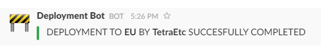

# deploy-notifications
Notify your team mates when deployments are being performed. Designed for teams that perform deployments manually into a 

## Requirements
- requests

## Installation
- `pip install -r requirements.txt`

## Usage
Using this script is nice and simple

```shell
$ cd /path/to/script/
$ python deploy-notifications.py --user="some_name" --url="webhook_url"
```

Doing this will send a POST request to `webhoook_url` which will post the 
default message into the channel associated with the webhook saying that
`some_name` commenced deployment to all servers.


There are three optional arguments that you can use with this script to
customize the message that's sent.
   
- `status`      - This allows you to specify the status of the deployment. It 
has three built in options:
    - `commenced` - This is the default option.
    - `completed` - For when the deployment has been finalized
    - `failed`    - Hopefully you never need to use this. For when something 
    has gone wrong and the deployment has failed.
    - As well as this, you can specify a custom status, and the library passes 
    this through
- `server` - This allows you to specify which server, or servers, the
deployment is being done on. 
- `channel` - This allows you to over-ride the channel the message is sent to
in Slack.
 
To use the script with all arguments:

```shell
$ cd /path/to/script/
$ python deploy-notifications.py --user="some_name" --url="webhook_url" --status="completed" --server="AU" --channel="deployment-notifications"
```


